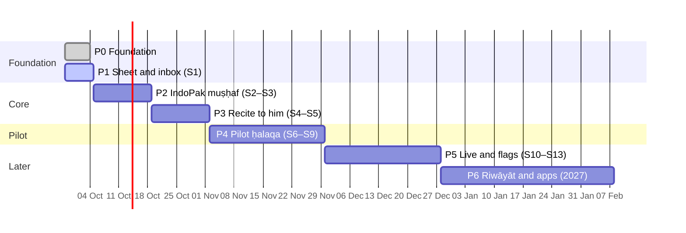

# ʿArḍa — Roadmap

- Date: 2026-10-03 (v2) · Cadence: one-week sprints starting Mondays · S0 and S1 ran in the
  week of **Mon 2026-09-28**; S2 starts **Mon 2026-10-05**. Stories and their acceptance live in
  [`sprint-plan.md`](sprint-plan.md); this page is the overview to follow.
- Capacity assumption: one developer with AI coding agents plus the owner as product owner, and
  the sheikh for content and review. **See "Portfolio capacity" below: Arqam plans the same
  months.**
- Every sprint ends on staging (`arda-stg.siralabs.org`) and is usable on its own.

## Status now (2026-10-04)

| Done                                                                                                                                                                                                                                        | In review                                                                                    | Next                                               |
| ------------------------------------------------------------------------------------------------------------------------------------------------------------------------------------------------------------------------------------------- | -------------------------------------------------------------------------------------------- | -------------------------------------------------- |
| P0; P1 (S1.1–S1.6: staging, engine, unit 2 and games, ḥalaqāt, assignments); S2.1–S2.4 muṣḥaf, offline; S3.2 assign on the page; S3.3 al-Fātiḥa and al-Baqara ([PRs #7–#11](https://github.com/Sira-Labs/Arda/pulls?q=is%3Apr+is%3Amerged)) | S2.2 IndoPak layer ([PR #12](https://github.com/Sira-Labs/Arda/pull/12)); S3.4 printed pages | S3.1 reciter player (waits for timings); units 3–4 |

Owner, 2026-10-04: keep going and merge PRs automatically; a status report every evening; al-Baqara
next (added to S3 as S3.3); the muṣḥaf as printed pages, IndoPak as the sheikh's (S3.4).

## Why this order

1. **The sheikh's sheet first.** Unit 2 from his own sheet, with games, gives students something
   real in week one and lets him judge the rule texts early (done in S1).
2. **The teacher link before the muṣḥaf.** Ḥalaqāt, invites and assignments make ʿArḍa useful to
   the sheikh before anything else exists; assignments start as sūra and āya ranges and move to
   word keys when the muṣḥaf arrives (ADR-0014).
3. **The muṣḥaf next**, because reading, hearing and assigning on the page all hang on it. It
   needs licensed text (ADR-0009), so the import tools come first.
4. **Recite to him** closes the loop of the product (spec 01 §4): the student records, the
   sheikh listens and marks. Only then is a pilot meaningful.
5. **The speech check is measured in the pilot, not promised before it.** It reaches students
   rule by rule only after it agrees with the sheikh (ADR-0013).
6. **Live lessons, AI flags, more units and riwāyāt** come after the pilot shows what matters.

The critical path is not code: the sheikh's answers, the IndoPak text licence and a speech
budget decide the dates more than the sprints do (see "Waiting on").

## Phases at a glance

| Phase                   | Sprints | Dates (approx.)    | Outcome / exit criteria                                                                                                                                                      | Release | Status    |
| ----------------------- | ------- | ------------------ | ---------------------------------------------------------------------------------------------------------------------------------------------------------------------------- | ------- | --------- |
| **P0 Foundation**       | S0      | Sep 28 – Oct 3     | Repository from Suffa's skeleton; specs, ADRs, threat model; auth ported and tested; CapRover files and CI; design system and shell; four languages                          | —       | done      |
| **P1 Sheet and inbox**  | S1      | Sep 28 – Oct 4     | Staging live with sign-in; tajwīd engine; unit 2 cards and games with review cards; ḥalaqāt, invites, assignments; "Von meinem Sheikh" first on Today                        | `v0.1`  | in review |
| **P2 IndoPak muṣḥaf**   | S2–S3   | Oct 5 – Oct 18     | Juzʾ ʿAmma pack (word keys, rule spans, IndoPak layer) installed offline; coloured pages with tap for the rule; reciter word by word, slow and loop; assignments on the page | `v0.2`  | next      |
| **P3 Recite to him**    | S4–S5   | Oct 19 – Nov 1     | Recording with offline upload; the sheikh's listening queue, marks and voice notes; ʿarḍ log; letter lab; units 1, 3, 4; progress syncs; production server                   | `v0.3`  | planned   |
| **🧪 Pilot starts**     | —       | **Mon 2026-11-02** | The sheikh and one ḥalaqa use ʿArḍa every week                                                                                                                               | —       | —         |
| **P4 Pilot ḥalaqa**     | S6–S9   | Nov 2 – Nov 29     | Weekly use; speech service running beside it, its hints only to the sheikh; agreement with him measured per rule; pilot feedback triaged                                     | `v0.4`  | planned   |
| **P5 Live and flags**   | S10–S13 | Nov 30 – Dec 27    | Live lessons (LiveKit); AI flags the sheikh confirms; first rules past the speech gate shown to students; units 5–7 (madd to waqf); Madīna muṣḥaf                            | `v1.0`  | planned   |
| **P6 Riwāyāt and apps** | 2027    | from Jan 2027      | Warsh and Qālūn; iOS and Android (Capacitor); more ḥalaqāt and teachers                                                                                                      | `v1.x`  | later     |

## Milestone gates

1. **G1 (end S1, `v0.1`):** the sheikh signs in as a teacher, opens a ḥalaqa, invites a student
   and gives an assignment; the student plays unit 2 and marks the assignment done. Route × role
   matrix green for every route.
2. **G2 (end S3, `v0.2`):** Juzʾ ʿAmma renders in IndoPak from the pack with no connection;
   every rule family is labelled; the import is reproducible with a checksummed manifest and
   attribution; the sheikh has checked the text against his muṣḥaf.
3. **G3 (end S5, pilot go/no-go):** a recording made offline reaches the sheikh's queue; only the
   ḥalaqa's teachers can play it (integration test); consent asked once; restore drill passed on
   the production server; the sheikh has reviewed the rule texts of units 1–4.
4. **G4 (end S9):** pilot feedback triaged; agreement between the speech check and the sheikh
   reported per rule (ADR-0013: ≥ 90 % on ≥ 200 occurrences before a rule reaches students).
5. **G5 (end S13, `v1.0`):** live lesson tested with the pilot ḥalaqa; AI flags reach students
   only after the sheikh confirms them; Madīna muṣḥaf renders from its pack.

## Waiting on

| Item                                                         | From               | Needed by            | Blocks                        | Status                                               |
| ------------------------------------------------------------ | ------------------ | -------------------- | ----------------------------- | ---------------------------------------------------- |
| The sheikh made a teacher on staging (admin action with 2FA) | owner              | now                  | G1 with him                   | open; a staging helper or admin page can do it       |
| Answers 1 and 4: iqlāb with ghunna; his lessons              | the sheikh         | S2 (Oct 5)           | unit 2 sign-off, pilot set-up | open                                                 |
| Answer 2: his IndoPak edition (13, 15 or 16 lines)           | the sheikh         | S2 (Oct 5)           | the page layout               | answered: 15 lines (ADR-0017 update)                 |
| IndoPak word-by-word text licence (ADR-0009 question 1)      | Tarteel, via owner | S2 (Oct 5)           | the IndoPak layer             | resolved: DigitalKhatt's text (MIT), ADR-0009 update |
| Answer 3: the reference reciter                              | the sheikh         | S3 (Oct 12)          | the player                    | open                                                 |
| Quran.com API registration for word timings                  | owner              | S3 (Oct 12)          | the player                    | open                                                 |
| RustFS buckets for recordings                                | owner              | S4 (Oct 19)          | recording                     | open                                                 |
| Production server and its secrets                            | owner              | S5 (Oct 26)          | the pilot                     | open                                                 |
| GPU host or CPU budget for the speech model (ADR-0013)       | owner              | S6 (Nov 2)           | the measurement               | open                                                 |
| Native review of the French and Arabic texts                 | owner              | before the pilot     | learners outside German       | open                                                 |
| `ARDA_ANTHROPIC_API_KEY` for translated remarks (ADR-0020)   | owner              | S4 (voice notes, T6) | remarks in other languages    | open; works without it, untranslated                 |

## Portfolio capacity

**Decision needed (owner).** Arqam's roadmap (decided 24 Sep 2026, option C) gives Arqam the
full capacity from Oct 5 until its private alpha on **2027-01-11**, and Suffa's later phases
slip for it. This roadmap plans one-week sprints for ʿArḍa in the same months. Both cannot hold
at full speed. Options:

| Option                                                           | Effect                                                                                                      |
| ---------------------------------------------------------------- | ----------------------------------------------------------------------------------------------------------- |
| **A. Keep both at this pace**                                    | Works only while AI agents carry most of the work, as in S0–S1 (each took about a day); review is the limit |
| **B. ʿArḍa in the gaps** (half pace)                             | Phases stretch ×2: pilot ≈ early December 2026, `v1.0` ≈ February 2027                                      |
| **C. ʿArḍa first until its pilot** (four more sprints, to Nov 1) | The sheikh gets his pilot on Nov 2; Arqam's alpha slips by about four weeks                                 |
| **D. Pause ʿArḍa after S1 until Arqam's alpha**                  | Pilot ≈ mid-February 2027; the sheikh keeps the sheet, the games and assignments meanwhile                  |

The external items above ("Waiting on") gate S2–S6 anyway; whichever option is chosen, asking
the sheikh and Tarteel now costs no development time.

Shared work lowers the cost: auth is kept in step with Suffa (ADR-0004, port log in the sprint
plan), the CapRover templates and workflows follow Suffa's, and the review cards, sync and
engagement come from Suffa (ADR-0002, ADR-0021).

## Risks

| Risk                                                           | Likelihood | Mitigation                                                                                      |
| -------------------------------------------------------------- | ---------- | ----------------------------------------------------------------------------------------------- |
| Portfolio capacity (four projects, one owner)                  | High       | Decide the option above; phases are usable on their own, so stopping after any one is safe.     |
| IndoPak text licence unclear                                   | Medium     | Ask Tarteel now; fallback: build the IndoPak layer per installation from Tanzil (ADR-0009).     |
| Speech model weak on learners                                  | Medium     | It hints only to the sheikh until it agrees with him, rule by rule (ADR-0013).                  |
| The sheikh's time                                              | High       | Assign and review in a few taps on a phone; voice instead of typing; he reviews texts per unit. |
| Rule texts or examples wrong                                   | Medium     | Texts from his sheet, marked draft until he confirms; fixtures from the sheet are tests.        |
| Word timings or reciter streams change terms                   | Medium     | Registered client, no caching beyond the terms; a second reciter source (ADR-0011).             |
| Recordings are sensitive (voices of minors)                    | Medium     | Consent once, private bucket, short-lived URLs, only the ḥalaqa's teachers (ADR-0012, T8).      |
| Drift between Suffa and ʿArḍa auth                             | Medium     | Same-week port rule and the port log; later a shared package (ADR-0002).                        |
| Shared staging host capacity                                   | Medium     | Production on its own server before the pilot; the speech model on its own host.                |
| Scope creep (live lessons, AI flags, riwāyāt before the pilot) | High       | Phase exit criteria; P5 and P6 hold everything the pilot does not need.                         |
