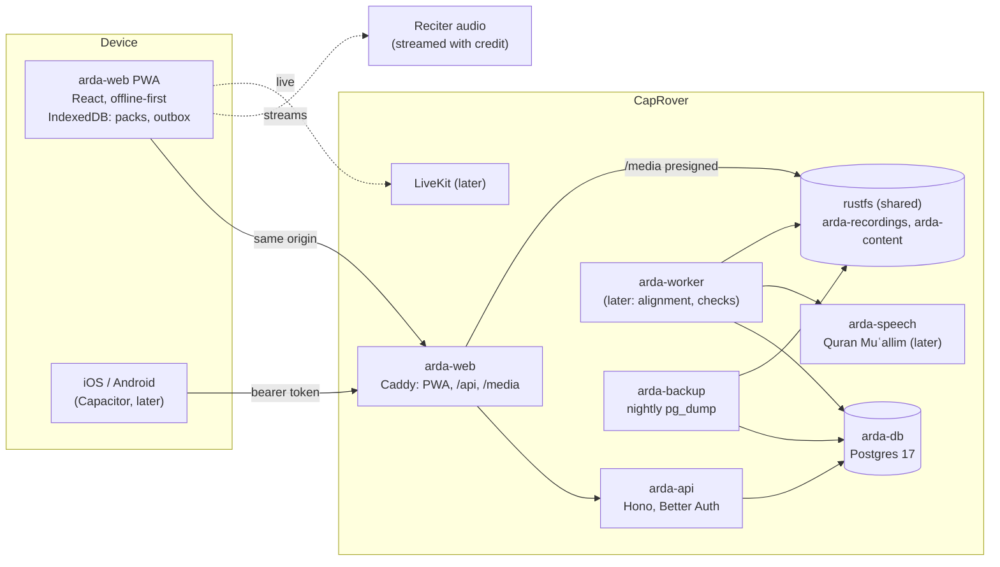

# 02 — Technical Specification

- Status: draft v1 · 2026-10-03
- Related: [01 product](01-product-spec.md), ADR-0002 to ADR-0019

## 1. Architecture



## 2. Repository layout

```
apps/api        Hono API: auth, account, admin, ḥalaqāt, assignments, health, migrations
                (TypeScript, raw pg); built as one ESM bundle that inlines the packages
apps/web        React + Vite PWA: shell, sign-in, design tokens, (next) units, muṣḥaf
packages/       tajweed: rule taxonomy, letter classes, detection; (next) mapping, lookup
                quran: the sūras and āya ranges (Tanzil metadata); (next) word keys
                (both pure TS, consumed as source: Vite for the web, esbuild for the api)
infra/          Dockerfiles, Caddyfile, CapRover captain-definitions and one-click templates,
                backup scripts
docs/           specs, ADRs, plan, ops, security
tools/          content import: Tanzil text and cpfair rules into checksummed packs;
                (next) IndoPak alignment, word timings
```

## 3. Stack

| Concern    | Choice                                            | Notes                                                   |
| ---------- | ------------------------------------------------- | ------------------------------------------------------- |
| Runtime    | Node 22, TypeScript 5, ESM                        | npm workspaces, one lockfile                            |
| API        | Hono 4 on `@hono/node-server`                     | dependency-injected routes, testable without a DB       |
| Auth       | Better Auth 1.7.6 + `@better-auth/passkey`        | ADR-0004; `@better-auth/core` pinned                    |
| DB         | Postgres 17, raw `pg`, plain SQL migrations       | advisory-locked runner, `schema_migrations`             |
| Validation | zod 3                                             | env config and request bodies                           |
| Build      | tsc (types), esbuild (api), Vite (web)            | the api bundle inlines `@arda/*`; npm packages external |
| Logging    | pino (api), small structured logger (web)         | JSON lines; never links, codes or addresses on failures |
| Web        | React 18, react-router 7, Vite 5, vite-plugin-pwa | offline shell; IndexedDB for packs (next)               |
| Tests      | Vitest (unit, jsdom), Postgres integration suites | `ARDA_TEST_DATABASE_URL`                                |
| Edge       | Caddy 2 behind CapRover's nginx                   | same-origin proxy, CSP, HSTS, X-Real-IP                 |

## 4. Data model

Built (migration `0001_users_and_auth`):

| Table           | Purpose                                                                        |
| --------------- | ------------------------------------------------------------------------------ |
| `users`         | id (uuid), email, role (`student`, `teacher`, `admin`), time zone, disabled_at |
| `sessions`      | Better Auth sessions; `second_factor_at` for admins                            |
| `accounts`      | kept for later sign-in methods (OIDC); no passwords                            |
| `verifications` | magic links and codes, hashed                                                  |
| `rate_limits`   | Better Auth rate-limit counters                                                |
| `passkeys`      | WebAuthn credentials                                                           |
| `user_totp`     | sealed TOTP secret, last step, failures, lock                                  |
| `audit_log`     | append-only record of privileged changes                                       |

Built (migration `0002_languages_and_translations`, ADR-0020):

| Table / column   | Purpose                                                                                                                |
| ---------------- | ---------------------------------------------------------------------------------------------------------------------- |
| `users.language` | `de`, `en`, `fr`, `ar` or null: interface, sign-in mail, translation target                                            |
| `translations`   | cached machine translations of written remarks per text and target language; author for the daily limit and the export |

Built (migration `0003_halaqat`, spec T1, ADR-0005):

| Table            | Purpose                                                                                                |
| ---------------- | ------------------------------------------------------------------------------------------------------ |
| `halaqat`        | name, one-to-one flag, the teacher who opened it (cascades with the teacher's account)                 |
| `halaqa_members` | ḥalaqa role (`teacher`, `student`) and status (`pending` until the teacher approves, `active`)         |
| `halaqa_invites` | SHA-256 of a 192-bit token, 14 days, revoked when a new link is made; the token itself is never stored |

Built (migration `0004_assignments`, spec T2, ADR-0014):

| Table                    | Purpose                                                                                                                  |
| ------------------------ | ------------------------------------------------------------------------------------------------------------------------ |
| `assignments`            | ḥalaqa, one student or all (`student_id` null), kind, sūra and āyāt, focus rule, repetitions, note, due day, who gave it |
| `assignment_completions` | who marked which assignment done, and when; what returns to the teacher                                                  |

Migration `0005_assignment_words` adds `word_from` and `word_to`: an assignment may start and
end at a word of its first and last āya (S3.2), the word keys `hafs:sura:aya:n`.
Migration `0009_assignment_pages` adds `page_layout` (`indopak-15` or `madina`), `page_from`
and `page_to`: an assignment may name pages of the printed muṣḥaf instead of āyāt (ADR-0014
update 2026-10-07); reading and reciting need one or the other, never both.

Both point at the student's membership (`halaqa_id, student_id` → `halaqa_members`): when a
student leaves, is removed or deletes the account, their own assignments and their completions
go too. The range is checked against the muṣḥaf (`@arda/quran`) and the rule against
`@arda/tajweed` by the API; the database keeps the shape (read and recite need āyāt, learn and
practise a rule). Word keys replace the sūra and āya columns when the content packs arrive.

Built (migration `0006_recordings`, spec F7 and T3, ADR-0012):

| Table             | Purpose                                                                                                                                                                                                                     |
| ----------------- | --------------------------------------------------------------------------------------------------------------------------------------------------------------------------------------------------------------------------- |
| `recordings`      | one take: the client's id (a retried upload lands once), ḥalaqa, student, the assignment it answers, sūra and āyāt, format, size, length, the teacher's verdict (`good`/`again`), quick remark, note, who answered and when |
| `recording_audio` | the sound, apart from the list so a list never reads it; until the bucket `arda-recordings` exists (ADR-0012 update 2026-10-06)                                                                                             |

Both cascade with the student's membership, so leaving, being removed or deleting the account
deletes the student's recordings; the export lists them without the sound.

Built (migration `0007_progress`, S5.2, ADR-0022):

| Table          | Purpose                                                                                                                            |
| -------------- | ---------------------------------------------------------------------------------------------------------------------------------- |
| `review_cards` | per person and card id (from the content): kind, prompt, expected rule card, box, due, lapses, `updated_at` (epoch ms; later wins) |
| `best_times`   | per person and timed game: the best time in milliseconds (better wins)                                                             |

Both cascade with the account and are in the export (`progress`).

Built (migration `0008_activity`, S5.2, ADR-0023):

| Table             | Purpose                                                                                                                           |
| ----------------- | --------------------------------------------------------------------------------------------------------------------------------- |
| `activity_events` | per person: the device's event id, the server's sequence number, kind (round or rule card), ref, time (epoch ms), right and total |

XP, levels and the streak are computed from it by `packages/engagement` (pure, shared by the
app and the API); it cascades with the account and is in the export (`activity`).

Migration `0010_reading_places` adds `reading_places`: per person and muṣḥaf script the page
last read and when ("Weiterlesen", ADR-0022 update 2026-10-07); the later one wins, it cascades
with the account and is in the export (`progress.places`).

Next (one migration per story, each cascading on user deletion and added to the export):

| Table                  | Story    | Key fields                                                                                  |
| ---------------------- | -------- | ------------------------------------------------------------------------------------------- |
| `recitation_marks`     | T3       | recording, word key, second, rule, remark, voice note key, by teacher                       |
| `arḍ_log` (`arda_log`) | T4       | student, sūra/range, date, verdict, note                                                    |
| `check_results`        | ADR-0013 | recitation, word key, rule, `good`/`check`, model version                                   |
| `flags`                | ADR-0016 | recitation, word key, rule, source (`teacher`/`ai`), status (`open`/`confirmed`/`rejected`) |

Content (Qurʾān text layers, rule spans, timings) lives in **content packs**, not in Postgres
(ADR-0010); Postgres stores only word keys that point into them.

## 5. API surface

Built:

| Method and path                                                        | Auth                                                | Purpose                                                                                        |
| ---------------------------------------------------------------------- | --------------------------------------------------- | ---------------------------------------------------------------------------------------------- |
| `GET /healthz`, `GET /api/healthz`                                     | —                                                   | status, version, schema revision, auth on/off (503 when degraded)                              |
| `GET /api/version`                                                     | —                                                   | name, version, schema revision                                                                 |
| `POST /api/v1/auth/sign-in/magic-link`                                 | —                                                   | send link and code (rate-limited)                                                              |
| `GET /api/v1/auth/magic-link/verify`                                   | —                                                   | open the link                                                                                  |
| `POST /api/v1/auth/sign-in/email-otp`                                  | —                                                   | sign in with the code                                                                          |
| `GET                                                                   | POST /api/v1/auth/passkey/*` (4 ceremony endpoints) | — / session                                                                                    | passkey sign-in and registration |
| `POST /api/v1/auth/sign-out`                                           | session                                             | sign out                                                                                       |
| `GET /api/v1/me`                                                       | `profile:read`                                      | id, email, name, role, time zone                                                               |
| `GET /api/v1/account/sessions`, `DELETE …/:id`, `POST …/revoke-others` | `profile:*`                                         | devices                                                                                        |
| `PATCH /api/v1/account/settings`                                       | `profile:write`                                     | time zone                                                                                      |
| `GET /api/v1/account/passkeys`, `DELETE …/:id`                         | `profile:*`                                         | passkeys, no key material                                                                      |
| `GET /api/v1/account/2fa`, `POST …/setup`, `POST …/confirm`            | `profile:*`                                         | TOTP                                                                                           |
| `GET /api/v1/account/export`, `DELETE /api/v1/account`                 | `profile:*`                                         | GDPR                                                                                           |
| `GET /api/v1/admin/users`, `PATCH …/:id`, `GET /api/v1/admin/audit`    | `admin:*` + 2FA                                     | admin area                                                                                     |
| `POST /api/v1/translations` `{ text, from?, to }`                      | `feedback:translate` (teacher, admin)               | a written remark in a student's language: `original`, `translated` or `unavailable` (ADR-0020) |

Built for T1 (`/api/v1/halaqat`, every route checked against every kind of caller in
`halaqat.routes.test.ts`):

| Method and path                                                    | Action                    | Purpose                                                    |
| ------------------------------------------------------------------ | ------------------------- | ---------------------------------------------------------- |
| `GET /`, `POST /` `{ name, oneToOne }`                             | `halaqa:join`, `:create`  | my ḥalaqāt (pending ones included); open one               |
| `POST /invites/preview`, `POST /join` `{ token }`                  | `halaqa:join`             | where a link leads; join as pending (token only in bodies) |
| `GET /:id`                                                         | `halaqa:read` (active)    | the ḥalaqa; its teacher also sees members and the link     |
| `POST /:id/invites`, `DELETE /:id/invites`                         | `halaqa:manage` (teacher) | a new link (shown once), or revoke it                      |
| `POST /:id/members/:userId/approve`, `DELETE /:id/members/:userId` | `halaqa:manage`           | approve or remove a student (audit-logged)                 |
| `DELETE /:id/membership`                                           | `halaqa:join`             | a student leaves                                           |

Built for T2 (mounted at `/api/v1`, every route checked against every kind of caller in
`assignments.routes.test.ts`):

| Method and path                                    | Action                    | Purpose                                                                                  |
| -------------------------------------------------- | ------------------------- | ---------------------------------------------------------------------------------------- |
| `GET /assignments`                                 | `halaqa:join`             | what I still have to do across my active ḥalaqāt, soonest due first                      |
| `GET /halaqat/:id/assignments?before=`             | `halaqa:read` (active)    | 50 at a time, latest due first; the teacher also sees who is done                        |
| `POST /halaqat/:id/assignments`                    | `halaqa:manage` (teacher) | give one: kind, student or all, range (and words) or pages, rule, repetitions, note, due |
| `DELETE /halaqat/:id/assignments/:aid`             | `halaqa:manage`           | take it back                                                                             |
| `PUT`, `DELETE /halaqat/:id/assignments/:aid/done` | `halaqa:study` (student)  | mark it done, or take the mark back                                                      |

Built for F7 and T3 (mounted at `/api/v1`, every route checked against every kind of caller
in `recordings.routes.test.ts`; sound answered with byte ranges, which Safari needs, and
`Cache-Control: private, no-store`):

| Method and path                                         | Action                    | Purpose                                                                                                         |
| ------------------------------------------------------- | ------------------------- | --------------------------------------------------------------------------------------------------------------- |
| `POST /halaqat/:id/recordings?clientId=…`               | `halaqa:study` (student)  | send a take: the body is the sound (WebM, Ogg, MP4), the query what it recites; ≤ 6 MB, 10 min, 500 per student |
| `GET /halaqat/:id/recordings?before=`                   | `halaqa:review` (teacher) | the queue, 50 at a time: waiting first, oldest first, then answered                                             |
| `GET /halaqat/:id/recordings/:rid/audio`                | `halaqa:review`           | hear it                                                                                                         |
| `PUT /halaqat/:id/recordings/:rid/review`               | `halaqa:review`           | answer `{ verdict, remark?, note? }`; again replaces it                                                         |
| `GET /recordings?before=`                               | `recitation:own`          | my recordings and their answers, newest first                                                                   |
| `GET /recordings/:rid/audio`, `DELETE /recordings/:rid` | `recitation:own`          | hear or delete my own                                                                                           |

Built for S5.2 (ADR-0022, every kind of caller in `progress.routes.test.ts`):

| Method and path                                                                       | Action         | Purpose                                                                                                                                                                                                                                                                                                                                                               |
| ------------------------------------------------------------------------------------- | -------------- | --------------------------------------------------------------------------------------------------------------------------------------------------------------------------------------------------------------------------------------------------------------------------------------------------------------------------------------------------------------------- |
| `POST /api/v1/progress/sync` `{ userId, cards, bestTimes, places?, events?, since? }` | `progress:own` | merge this device's deck and reading places into the account's and answer with the result; store the activity events it sends (once per id) and answer with the events after `since`, 1,000 at a time (`more`); 409 `other_account` when the session is no longer `userId`'s; ≤ 5,000 cards, 100 games, 500 events per request, 100,000 events per person, 2 MB (413) |

Next: `/api/v1/arda-log/*` (T4). Every route names one policy action (ADR-0005) and is
added to the route-by-role matrix test.

## 6. Configuration (`ARDA_*`)

| Variable                                                                                     | Required              | Meaning                                                                              |
| -------------------------------------------------------------------------------------------- | --------------------- | ------------------------------------------------------------------------------------ |
| `ARDA_ENV`                                                                                   | — (`dev`)             | `dev`, `test` or `prod`; prod enforces secrets                                       |
| `ARDA_PORT`                                                                                  | — (8000)              | HTTP port                                                                            |
| `ARDA_DATABASE_URL`                                                                          | yes                   | `postgres://…`; in prod with a generated password ≥ 16 chars                         |
| `ARDA_DB_POOL_MAX`                                                                           | — (10)                | connection pool size                                                                 |
| `ARDA_AUTH_SECRET`                                                                           | prod                  | ≥ 32 random chars; signs sessions, seals TOTP secrets                                |
| `ARDA_PUBLIC_URL`                                                                            | prod                  | e.g. `https://arda-stg.siralabs.org`; links in mails, passkey relying party          |
| `ARDA_TRUSTED_ORIGINS`                                                                       | —                     | more web origins (while moving domains)                                              |
| `ARDA_APP_ORIGINS`                                                                           | —                     | native app origins (bearer tokens, CORS without credentials)                         |
| `ARDA_SMTP_HOST`, `ARDA_SMTP_PORT`, `ARDA_SMTP_USER`, `ARDA_SMTP_PASSWORD`, `ARDA_MAIL_FROM` | for sign-in           | Google Workspace SMTP relay                                                          |
| `ARDA_MAIL_DIR`                                                                              | —                     | browser tests: links to files (never in prod)                                        |
| `ARDA_ANTHROPIC_API_KEY`                                                                     | —                     | Claude key for translating written remarks; translation is off without it (ADR-0020) |
| `ARDA_TRANSLATE_MODEL`                                                                       | — (`claude-opus-5-5`) | model for translations                                                               |
| `ARDA_TRANSLATE_DAILY_LIMIT`                                                                 | — (200)               | new translations per teacher and day; cache hits do not count                        |
| `ARDA_LOG_LEVEL`, `ARDA_VERSION`                                                             | —                     | logging; release tag reported by health                                              |

Web (`arda-web` container): `ARDA_API_UPSTREAM`, `ARDA_MEDIA_UPSTREAM`, `ARDA_VERSION`.
Backup: `ARDA_BACKUP_*` (runbook).

## 7. Open technical items

1. Speech service sizing: GPU host or CPU budget for Quran Muʿallim (ADR-0013).
2. IndoPak text source with a clear licence (ADR-0009 question 1).
3. Port Suffa's sync (outbox, last write wins) for progress (story L3) and its engagement
   package; decide when both move to shared packages (ADR-0002).
4. LiveKit on CapRover: TURN and UDP ports (ADR-0015).
